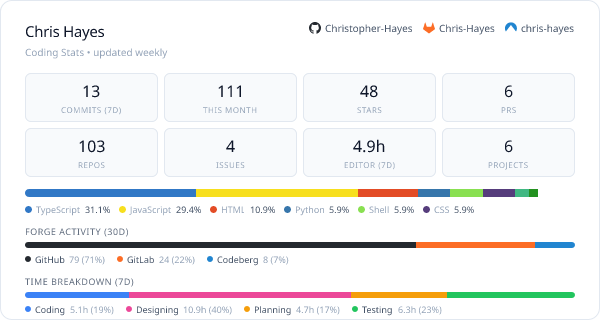

## I'm Chris, a web dev who loves design and open-source.

⚡ I make websites—brands, 3D, shops, museums…

💻 Often with Next, WebGL, Web Components, Tailwind…

🐦‍🔥 I maintain the FOSS alternative to GitHub Copilot, [the VSCode Extension ”ChatGPT Reborn”](https://github.com/Christopher-Hayes/vscode-chatgpt-reborn)

🌱 Right now I'm learning Godot.

<picture>
  <source media="(prefers-color-scheme: dark)" srcset="coding-stats-dark.png">
  
</picture>

 
 
 

