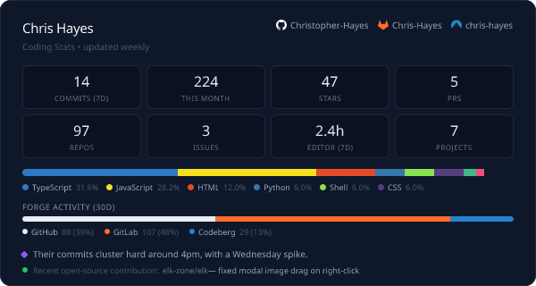

## I'm Chris, a web dev who loves design and open-source.

⚡ I make websites—brands, 3D, shops, museums

💻 Often with Next, WebGL, Web Components, and Tailwind

🐦‍🔥 I maintain the FOSS alternative to VS Code Copilot, [the VSCode Extension, "ChatGPT Reborn"](https://github.com/Christopher-Hayes/vscode-chatgpt-reborn)

🌱 Right now I'm learning Godot.

